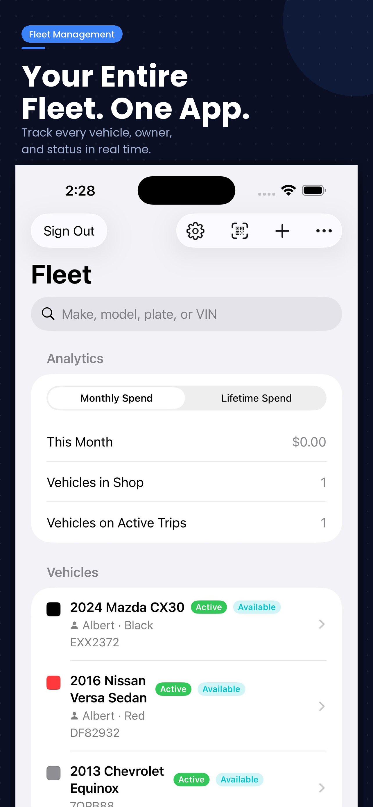
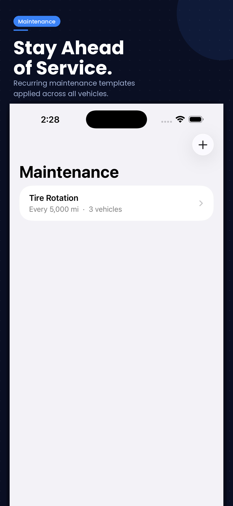
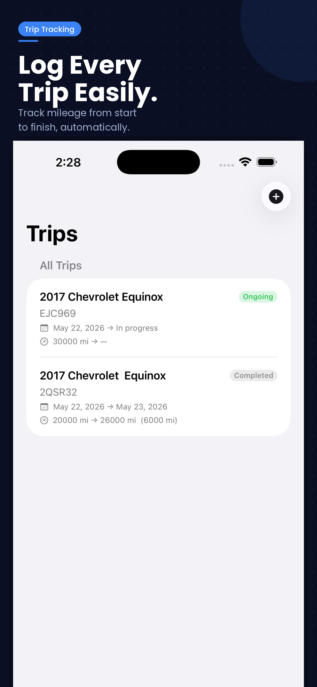
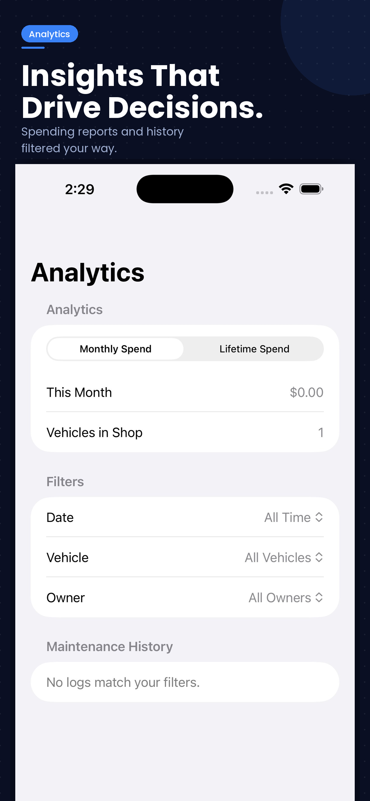
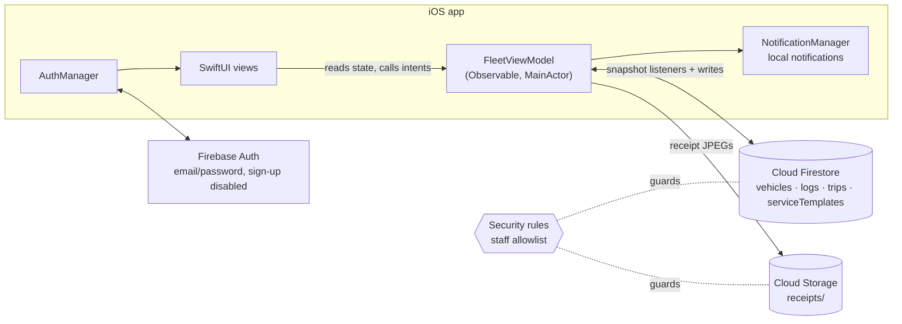

# Fleet Ops for iOS

[](https://github.com/fernandojcardenas/fleet-ops-ios/actions/workflows/ci.yml)

A SwiftUI + Firebase app for running maintenance on a small rental fleet. It is live on the App Store as **[Rental Fleet Management](https://apps.apple.com/us/app/rental-fleet-management/id6770574201)** (version 0.1.4, iOS 26.5+, iPhone and iPad) and is used day to day by FAJ Management LLC, the rental business it was built for.

This repository is the public, documented copy of that app's source. It starts from the real development history (May 13–27, 2026). Before publishing, the Firebase config file and per-user Xcode files were stripped from every commit. After that come the security hardening, tests and CI described below.

## Why it exists

A rental fleet needs maintenance done on time, and it needs to know which car is out on a trip, which is in the shop, and what each one has cost. Fleet Ops puts all of that on staff phones. Staff scan a QR sticker in the door jamb to log work or start and end a trip. They can see at a glance which vehicles are due, and export a vehicle's full service history as a PDF.

## What it does

Everything below is in the code in this repository.

| Area | What the app does | Where |
|---|---|---|
| Fleet dashboard | Vehicle list with health %, maintenance status (Active / In Shop / Recall / Out of Service) and operational status (Available / On a trip). Counters for vehicles in the shop and trips in progress. Filter to "due for service", sort, reorder. | `HomeView.swift` |
| Vehicles | Make, model, year, VIN, plate, owner, color, lockbox code; edit and delete (logs cascade-delete) | `AddVehicleView`, `EditVehicleView`, `VehicleDetailView` |
| Service schedules | Reusable templates ("Oil Change every 5,000 mi") assigned to vehicles, per-vehicle interval overrides, skip-a-service logs that reset the interval without a cost | `ServiceTemplate*`, `FleetViewModel.serviceHealth` |
| Maintenance logs | Date, mileage, cost, notes, receipt photo from camera or library, edit and replace receipts | `AddLogView`, `EditLogView`, `ReceiptViewer` |
| Trips | Start and end trips with odometer readings, manual entry of past trips, edit trips; vehicle operational status follows the trip | `Trip*View`, `ManualTripFormView` |
| QR workflow | Print a QR code per vehicle; scanning it offers Trip Start, Trip End or Maintenance for that vehicle | `QRGenerator`, `QRScannerView`, `VehicleQRView` |
| Analytics | Spend this month / lifetime, maintenance history filtered by date range, vehicle and owner | `AnalyticsTabView.swift` |
| PDF export | Per-vehicle service history report with totals and receipt indicators, shared through the iOS share sheet | `VehicleHistoryPDF.swift` |
| Alerts | Local notifications when a vehicle drops below 15% health, comes within 500 mi of a service, or is marked Recall; one alert per vehicle, updated in place | `NotificationManager.swift` |
| Accounts | Email/password sign-in, onboarding, company logo, in-app account deletion with re-authentication (App Store requirement) | `AuthManager`, `SettingsView` |
| Offline | Firestore on-device persistence, so the app works in a parking lot with no signal and syncs later | `Fleet_Maintenance_TrackerApp.swift` |

## Screenshots

The App Store screenshots for version 0.1.4, captured from the shipped app:

| Fleet dashboard | Service schedules | Trips | Analytics |
|:---:|:---:|:---:|:---:|
|  |  |  |  |

To reproduce these screens locally with fictional data, run the app in emulator mode ([firebase/README.md](firebase/README.md)).

## Architecture



One `@Observable` view model owns all fleet state and keeps it live with four Firestore snapshot listeners. Views never touch Firebase directly. Details: [docs/architecture.md](docs/architecture.md). Decisions: [docs/adr/](docs/adr/).

## Security

The app holds lockbox codes, VINs and owner names for real vehicles, so access control is the part that matters most. While documenting the app I found that the rules live in production let **any** signed-in account read and change everything. The only thing preventing abuse was that self sign-up was switched off. I replaced those rules with a staff allowlist that clients can't modify, added field validation, and wrote 28 tests that run on the Firebase emulators, including two that reproduce the original weakness.

- Write-up and deploy runbook: [docs/security/firestore-rules-hardening.md](docs/security/firestore-rules-hardening.md)
- STRIDE threat model: [docs/threat-model.md](docs/threat-model.md)
- Rules and tests: [firebase/](firebase/)

## Run it

Two ways to run it. For a recruiter or reviewer, the fastest is the rules test suite:

```sh
cd firebase && npm ci && npm test
```

To run the app itself against fictional demo data (Xcode 26.5+, Node 22+, Java 21+), follow [firebase/README.md](firebase/README.md): start the emulators, seed, then launch a Debug build with `-useFirebaseEmulators`. Building against a real Firebase project is covered in [docs/setup.md](docs/setup.md).

## CI

Every push runs three jobs ([workflow](.github/workflows/ci.yml)):

1. gitleaks over the full git history
2. Firestore and Storage rules tests plus the demo seed, on the emulators
3. a Debug build for the iOS Simulator on a macOS runner

There are no XCTest unit tests yet. Adding them for the service-health logic is the next item in [docs/known-issues.md](docs/known-issues.md).

## What I designed and decided

I (Fernando Cardenas) own this product end to end. I identified the problem in my own rental business, chose the feature set and the workflow around QR stickers in door jambs, chose SwiftUI and Firebase, and shipped and operate the app on the App Store.

The code was written with AI pair programming (Claude). Commits carry `Co-Authored-By` trailers so that is visible in the history. In this public release I made these decisions:

- replace the live rules with a staff allowlist rather than per-user data
- keep the real development history instead of squashing it
- keep all demo data on a local emulator instead of a second cloud project
- keep the code all-rights-reserved

## Repository layout

```
Fleet Maintenance Tracker/        SwiftUI app source (flat, one file per screen)
AnalyticsTabView.swift            Analytics tab (sits at the root; see known issues)
Fleet Maintenance Tracker.xcodeproj
firebase/                         Security rules, rules tests, emulator seed
docs/                             Architecture, ADRs, threat model, security write-up
.github/workflows/ci.yml          CI
```

## Status and known issues

Shipping and in use. Honest list of gaps and tech debt: [docs/known-issues.md](docs/known-issues.md).

## License

Copyright © 2026 FAJ Management LLC. All rights reserved. The source is published so it can be read and evaluated. It is not licensed for reuse. See [LICENSE](LICENSE).
