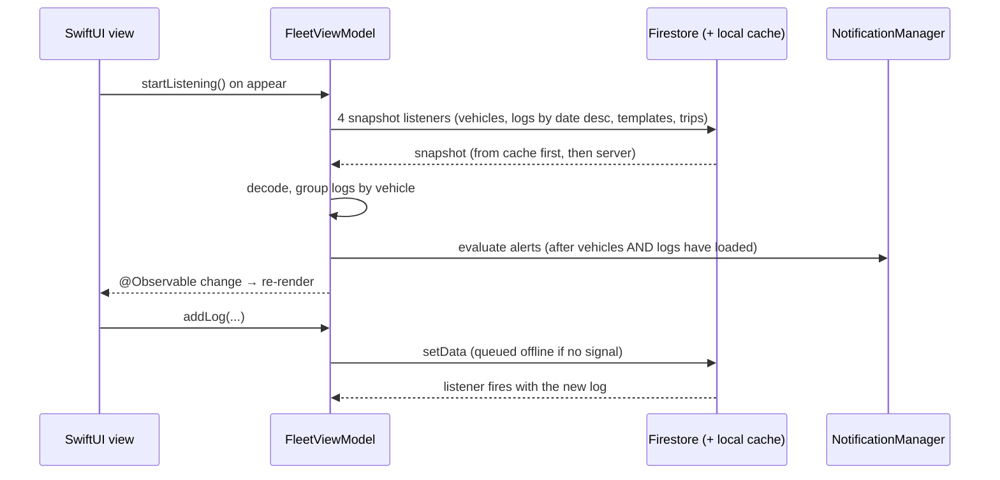

# Architecture

## Layers

| Layer | Types | Responsibility |
|---|---|---|
| App entry | `Fleet_Maintenance_TrackerApp`, `AppDelegate` | Configure Firebase (production or local emulators), Firestore persistence, notification delegate |
| Routing | `RootView`, `MainTabView` | Sign-in gate, onboarding, deep links (`fleetmaintenance://vehicle/<id>`), four tabs: Fleet, Maintenance, Trips, Analytics |
| State | `FleetViewModel` (`@Observable`, `@MainActor`) | Single source of truth for vehicles, logs, templates and trips; all Firestore reads and writes; derived values (health, status, spend) |
| Auth | `AuthManager` (`@Observable`) | Sign-in, sign-out, re-authentication, account deletion |
| Side effects | `NotificationManager`, `CompanyProfile`, `QRGenerator`, `VehicleHistoryPDF` | Local notifications, logo on disk, QR images, PDF rendering |
| Views | ~30 SwiftUI files, one per screen | Render state and call view-model methods. They never import Firebase directly |

Why one view model instead of one per screen: [ADR 0001](adr/0001-single-observable-fleet-view-model.md).

## Data model (Cloud Firestore)

All collections are top-level and belong to the one company.

| Collection | Key fields | Written by |
|---|---|---|
| `vehicles/{id}` | `make`, `model`, `year` (int), `vin`, `licensePlate`, `addedBy` (uid), `status`, `operationalStatus`, `owner`, `color`, `lockboxCode`, `qrCode`, `serviceInterval?`, `customServiceIntervals?` (template id → miles) | `addVehicle`, `updateVehicle`, status updates |
| `logs/{id}` | `vehicleID`, `serviceType`, `date` (timestamp), `mileage` (int), `cost` (double), `notes`, `receiptURL?`, `isSkipped?` | `addLog`, `updateLog`, `skipService` |
| `trips/{id}` | `vehicleID`, `dateStart?`, `dateEnd?`, `mileageStart?`, `mileageEnd?`, `status` (`Active`/`Completed`), `isOngoing?`, `notes?` | `startTrip`, `endTrip`, `addCompletedTrip`, `updateTrip` |
| `serviceTemplates/{id}` | `serviceName`, `mileageInterval` (int), `assignedVehicleIDs` | template screens |
| `staff/{uid}` | `name` | Firebase console only (rules deny client writes) |
| `users/{uid}` | per-user record | deleted on account deletion |

Receipts live in Cloud Storage at `receipts/<uuid>.jpg` (JPEG, quality 0.8). The log stores the download URL.

Optional fields (`status?`, `isOngoing?`, `qrCode?`) exist because documents written by earlier builds lack them. Each model has an `effective…` accessor that supplies the default, so old data keeps decoding without a migration.

## Data flow

Writes don't update local arrays by hand. They write to Firestore and let the listener deliver the change, so offline writes, other staff members' writes and the app's own writes all take the same path.

## Service health

Two calculations exist (see [known issues](known-issues.md)):

- **Template health** (`serviceHealth`, `fleetHealth`), the current system. For each template assigned to a vehicle:
  - `remaining = lastMatchingServiceMileage + interval − currentMileage`, where the interval is the vehicle's override if one is set.
  - Status is overdue if `remaining < 0`, red below 200 mi, yellow at 1,000 mi or less, green above that.
  - Fleet health % is the worst template's `remaining / interval`. A log whose `serviceType` contains the template name counts as that service, and skipped-service logs do too, which is how "skip" resets an interval.
- **Legacy status** (`serviceStatus`) uses the vehicle's single `serviceInterval` and the hard-coded service types "oil change" and "brake service". It drives the Home "due for service" filter and "Service Due" notifications.

`currentMileage` is the mileage on the **most recent log by date**.

## Notifications

`NotificationManager` evaluates every vehicle whenever vehicles or logs change. It keeps **one pending notification per vehicle** (identifier = vehicle id), replacing or removing it as the state changes:

- *Low Health Alert* when health drops below 15%
- *Service Due Soon* within 500 mi of a template milestone
- a combined message when both apply

Separately, the view model sends one-off notifications when a vehicle changes to *Recall*, or when the legacy status becomes due.

## QR codes and deep links

Each vehicle's QR code encodes its Firestore document ID, which never changes. Scanning resolves the string with `vehicleID(forScannedToken:)`, which accepts either the document ID or the vehicle's stored `qrCode` token, then offers *Trip Start*, *Trip End* or *Maintenance*. `fleetmaintenance://vehicle/<id>` URLs from older printed codes still route through `RootView.onOpenURL`.

## Environments

| Build | Backend |
|---|---|
| Release (App Store) | Production Firebase project from `GoogleService-Info.plist` (not in git) |
| Debug | Same as Release by default |
| Debug + `-useFirebaseEmulators` | Placeholder `demo-fleet-ops` project configured in code; Auth, Firestore and Storage on `127.0.0.1` (see [firebase/README.md](../firebase/README.md)) |
