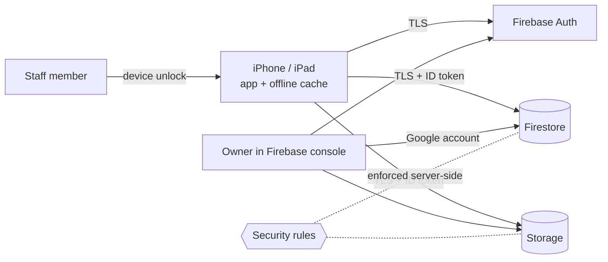

# Threat model (STRIDE)

Scope: the iOS app, Firebase Auth, Cloud Firestore and Cloud Storage as configured by this repository. Written 2026-09-27. Status marks what is **done in this repo**, **needs a production step**, or is **open**.

## What we protect

| Asset | Why it matters |
|---|---|
| Lockbox codes | Physical access to vehicle keys |
| VINs, plates, owner names, colors | Locating and identifying specific cars and their owners |
| Maintenance history and receipts | Business records; receipts may show addresses or payment details |
| Trip records | Who has which car, and when |
| Staff accounts | Everything above follows from one compromised login |

## Trust boundaries

The device and the app binary are **not** trusted: anyone can extract the Firebase config from the IPA and call the APIs directly. Only the server-side rules and Auth decide access.

## Threats

| ID | STRIDE | Threat | Mitigation | Status |
|---|---|---|---|---|
| S-1 | Spoofing | Stranger creates an account and signs in | Self sign-up disabled in Firebase Auth; rules additionally require `/staff/{uid}` | Sign-up off in production; allowlist **needs deploy** |
| S-2 | Spoofing | Guessed or reused staff password | Email enumeration protection on. No MFA and no password policy yet | **Open**: enable Firebase password policy; consider MFA or Sign in with Apple |
| S-3 | Spoofing | Scripted calls with the public Firebase API key | The key is an identifier, not a secret. Rules and Auth do the protecting. App Check would bind requests to the genuine app | **Open**: App Check (App Attest) not configured |
| T-1 | Tampering | Non-staff account edits or deletes fleet data | Allowlist rules; tested in `firestore.test.mjs` | Done in repo, **needs deploy** |
| T-2 | Tampering | Staff client writes malformed data that breaks decoding for everyone | Type and range validation per collection | Done in repo, **needs deploy** |
| T-3 | Tampering | Receipt replaced with HTML or a huge file | Storage rules accept only `image/*` under 15 MB | Done in repo, **needs deploy** |
| T-4 | Tampering | User grants themselves staff | `/staff` has `allow write: if false` | Done in repo, tested |
| R-1 | Repudiation | Can't tell who changed a log or ended a trip | Only `addedBy` on vehicles is recorded (and now immutable). Logs and trips have no author or timestamp | **Open**: add `updatedBy` / `updatedAt` enforced by rules |
| I-1 | Info disclosure | Any signed-in account reads lockbox codes (**the live issue found**) | Staff allowlist | Done in repo, **needs deploy** ([write-up](security/firestore-rules-hardening.md)) |
| I-2 | Info disclosure | Lockbox codes in plain text on every staff device and in the offline cache | iOS Data Protection encrypts at rest when the device is locked | **Open**: consider restricting lockbox codes to a narrower role |
| I-3 | Info disclosure | Receipt **download URLs** carry a token and bypass Storage rules. Anyone holding a URL can fetch the image | URLs live only in Firestore documents that are now staff-only | Accepted after deploy; revocable per file in the console |
| I-4 | Info disclosure | Debug logging prints the sign-in email and Firebase UIDs to the device console in all builds | None yet | **Open**: gate `print` behind `#if DEBUG` or use `os.Logger` with private redaction |
| I-5 | Info disclosure | Secrets or real data in public git history | History rewritten to drop the Firebase plist and per-user Xcode files; gitleaks in CI on every push | Done |
| D-1 | Denial of service | Mass writes or reads run up the Blaze bill | Allowlist limits callers to staff; App Check would limit to the genuine app | **Open**: set a Google Cloud budget alert |
| D-2 | Denial of service | Staff locked out by a bad rules deploy | Runbook orders allowlist before rules; console rules history allows instant rollback | Documented |
| E-1 | Elevation | Signed-in non-staff account acts as staff | Allowlist on every collection and in Storage | Done in repo, tested |
| E-2 | Elevation | The App Store review login has full staff access to production data | Required for review to pass today | **Open**: give reviewers a separate demo tenant, or remove the account from `/staff` between reviews |

## Retention and deletion

Receipts are never deleted from Storage: not when a log is edited, not when a vehicle is deleted, not when an account is deleted. Deleting an account removes the Auth user and `/users/{uid}` only. The fleet data stays, which is intentional because it belongs to the company. Tracked in [known issues](known-issues.md).
